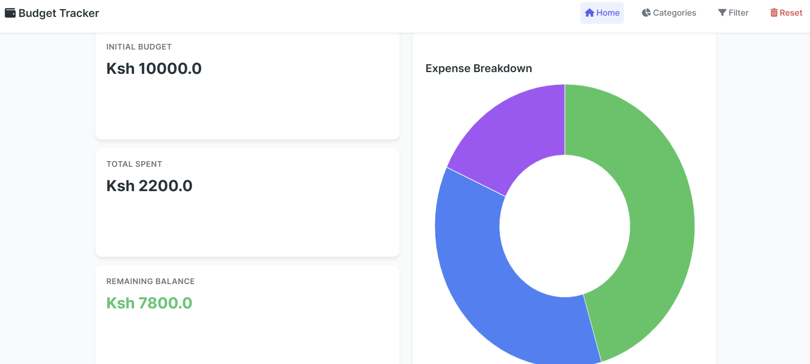
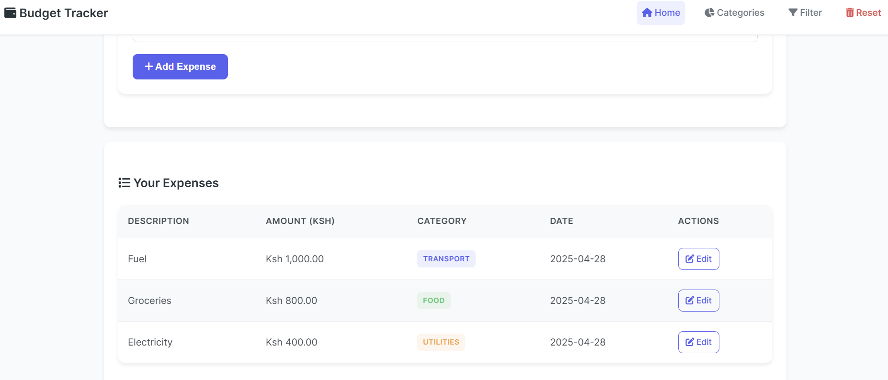

# 💰 Budget Tracker (Flask)

A simple, responsive budget-tracking web app built with Python and Flask. Users can set a budget, add and edit expenses, view spending summaries by category, filter expenses, and reset all data. It stores data securely in a PostgreSQL database using SQLAlchemy ORM.

---

## 🚀 Features

- 💵 Set and reset an initial budget
- ✏️ Add and modify expenses
- 🔍 Filter expenses by category
- 📊 View totals by category
- ⚠️ Warnings when you're over budget or low on funds
- 📱 Fully responsive layout
- ❌ Erase all data and start fresh

---

## 🛠 Built With

- [Python 3](https://www.python.org/)
- [Flask](https://flask.palletsprojects.com/)
- HTML + CSS (vanilla)
- SQLAlchemy
- PostgreSQL

---

## 📸 Screenshots




---

## 🧪 Getting Started

### 1. Clone the Repository

```bash
git clone https://github.com/melmuya/budget-tracker.git
cd budget-tracker

```
### 2. Create Virtual Environment
```
python -m venv venv
source venv/bin/activate  # Windows: venv\Scripts\activate

```
### 3. Install Dependencies
```
pip install flask

```
### 4. Set Up Environment Varaibles
```
DATABASE_URL=your_postgresql_database_url

```
### 5. Run Database Migrations

If needed, create tables manually or using SQLAlchemy inside app.py

### 6. Run the App
```
python app.py

```
### 📄 .gitignore
```
Make sure your .gitignore includes:

# Python
__pycache__/
*.pyc

# Virtual environment
venv/

# Environment variables
.env

# Local data file (no longer used)
budget_data.json

```
## 📄 License

This project is open for educational or personal use.
Feel free to fork it, build on it, and make it your own!


## 👤 Author

**Melchizedek Maranga**  
- [kingzedek.com](https://kingzedek.com)  
- [GitHub: @melmuya](https://github.com/melmuyayour-username)  
- [LinkedIn: https://www.linkedin.com/in/melchizedek-maranga/]  

```

